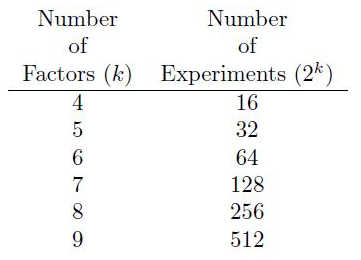
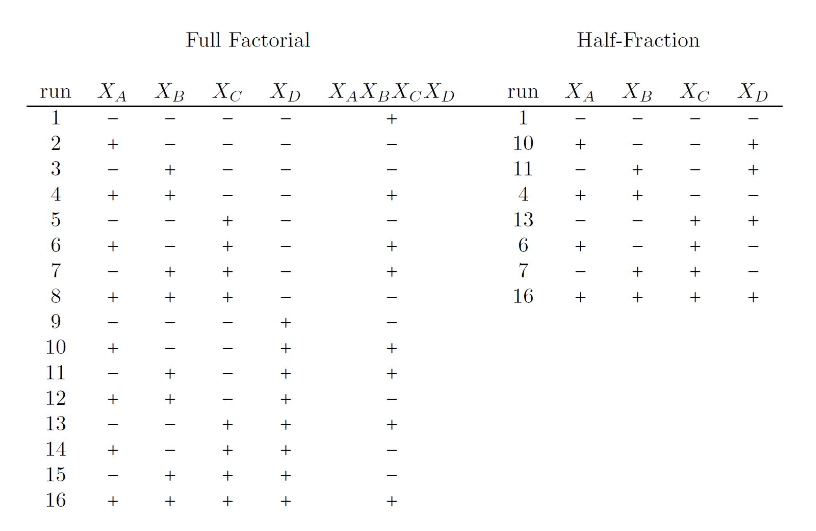
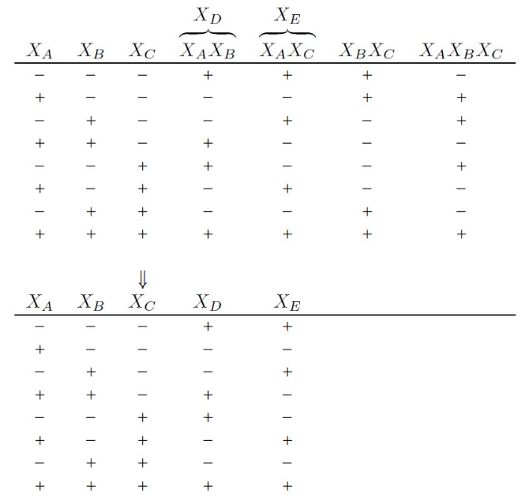
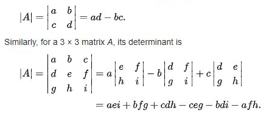

```{r setup, include=FALSE}
knitr::opts_chunk$set(echo = TRUE,
                      cache = TRUE, 
                      warning = FALSE,
                      message = FALSE)
```

## Topics Covered

1.  The size of two-level factorial designs (Lawson 6.1)

2.  Principles of design of screening experiments (Lawson 6.2 and notes).

3.  Half-fractions of a full factorial construction (Lawson 6.2 and notes).

4.  Analysis of a replicated half-fractions of a full factorial (notes).

5.  Resolution of a fractional design (notes).

6.  Smaller fractions of a full factorial design (Lawson 6.3).

7.  Analysis of smaller fractions of a full factorial design (notes).

8.  Adding follow up runs to a fractional factorial (notes).

9.  Creating D-optimal follow up runs using R (notes).

10. High level understanding of D-optimally (notes).

## Benefits of Factorial Designs

We have already seen the gains in efficiency (power) when we study many factors together as opposed to one at a time.

We have also seen how it is possible to measure and understand interaction effects between factors when we study many factors together.

The more factors we put in a factorial design the greater the efficiency and the greater the number of interactions that may be detected.

We have seen how to reduce the number of required runs (for a similar power) in a factorial design by using only two levels of each factor.

But even using $2^k$ designs there is a sharp increase in required run size for larger numbers of factors.



At this point many researchers might bail and call these types of experiments too complex or inappropriate (and we can discuss when that is really the case). But one of the only ways to get at the optimum configuration is going to be to use all of the factors at once.

The solution to the problem of having a large run size and keep the same number of factors is to use just a [piece of the full factorial experiment (a fraction)]{.underline}.

9 main effects - 800 2.f int, x 3.f int,....

These fractions are carefully chosen so that orthogonality is maintained between certain factor effects.

There are three key ideas we need to understand to embrace these smaller *screening* designs.

1.  **The sparsity of effects principle**. When there are several variables, the system or process is likely to be driven primarily by some of the main effects and low-order interactions.

2.  **The projection property**. Fractional factorial designs can be projected into stronger (larger) designs in the subset of significant factors.

3.  **Hierarchical ordering principle** main effects are more likely to be important than two-factor interactions, and two-factor interactions are more likely to be important than three-factor interactions, and so forth. (the largest contribution of moving y in the direction I want comes from the 2.f interactions; 3.f interactions and + have a negligible effect)

4.  **Sequential experimentation. It is possible to combine the runs of two (or more) fractional factorials to construct sequentially a larger design to estimate the factor effects and interactions of interest.**

## Half-Fractions

How many effects can be estimated from a $2^4$ design? List them out.

-   15 (2\^4 -1)

    -   4 main effects, 6 2.f, 4 3.f, 1 4.f

```{r}
choose(4,3)
```

If we assume that the largest, most important effects are most likely to be the main effects, then maybe the two factor interactions and rarely the three factor interactions, why should we waste experimental runs to be able to estimate those effects?



We refer to half fractions as $2^{k-1}$ designs.

We construct these designs by hand by doing the following steps:

1.  Write down the base design, a full factorial plan in k − 1 factors using the coded factor levels (−1) and (+1).

2.  Add the $k^{th}$ factor to the design by making its coded factor levels equal to the product of the other factor levels (i.e., the highest order interaction).

3.  Use these k columns to define the design.

To create the $2^{4-1}$ design shown above:

```{R}
library(FrF2)
d<-FrF2(8, 3, randomize=FALSE)
d
```

Below is a correlation plot showing the full confounding in the design.

```{r}
d<-FrF2(nruns = 8, nfactors = 4, randomize=FALSE)
d<-lapply(d, function(x) as.numeric(as.character(x))) ## change factors to character then to numeric
d<-as.data.frame(d)
X<-model.matrix(~0+.^3, d)
M<-cor(X)
library(corrplot)
corrplot(M)
```

And you can get R to show you the aliasing pattern using the `alias` function in `FrF2`.

```{r}
d$y<-rnorm(8)
aliases( lm( y~ (.)^3, data = d))

```

So what if we found A to be active?

-   always assume 3 way interactions are negligible

So what if we found A:B to be active?

-   2.f interactions are more of a problem

And if we were really **unsure of the analysis, we could just go ahead and run the additional 8 treatment combination to "break" the aliasing between the two factor interactions.**

These additional treatment combinations happen to be the mirror image of the first 8 treatment combinations (since they are just the columns with the opposite sign for the highest order interaction).

-   full foldover = add the rest off the fraction

```{R}
d<-FrF2(8, 4, randomize=FALSE)
d2 <- fold.design(d, columns = 'full')
d2

```

How would your analysis change if you added the "mirror" combinations onto a design that you have already run?

-   add a block effect

Now most of the literature that you read is going to tell you to run these half-fractions without replication. With good reason, I mean if you are severely restricted in run size, why would you replicate?

But in the online testing world, or in store testing world, we are not restricted on run size. **We are restricted on treatment combinations**.

**The reason you need to learn to use fractional factorial design is to lessen the required number of treatment combinations in an experiment**.

We will analyze these as replicated designs. Here is how.

Below is a $2^{4-1}$ design with three replicates and a simulated response.

```{r}
d<-FrF2(8, 4, randomize=FALSE)
d<-lapply(d, function(x) as.numeric(as.character(x)))
d<-as.data.frame(d)
d<-rbind(d, d, d)
d$y<-rnorm(24)

```

We know we have only 8 degrees of freedom for the analysis. I have only 8 columns that are completely uncorrelated. So we can't include the full factorial model. What should I include?

-   Alias pattern

```{r}
reg<-lm(y~A+B+C+D+A:B+A:C+A:D, data=d)
summary(reg)
```

This next analysis is wrong, but here is what would happen if I included more effects than I have degrees of freedom to estimate:

```{r}
reg<-lm(y~A+B+C+D+A:B+A:C+A:D+B:C, data=d)
summary(reg)

```

```{r, echo=FALSE}
df<-read.csv("https://raw.githubusercontent.com/losiewbw/ISA633/main/marketing%20experiment.csv")
df$ABCD<-df$A*df$B*df$C*df$D
df.half<-df[which(df$ABCD==1),]
write.csv(df.half[,-6], "M:\\ISA633\\GitHub\\ISA633\\marketing experiment half.csv", row.names = FALSE)
df.half2<-df[which(df$ABCD==-1),]
write.csv(df.half2[,-6], "M:\\ISA633\\GitHub\\ISA633\\marketing experiment half 2.csv", row.names = FALSE)
```

## Example

Let's revisit the marketing experiment which was originally a $2^{4}$ experiment. The file "marketing experiment half.csv" contains a half fraction $2^{4-1}$ of the original data. Recall the response is a count of folks who responded to the offer out of 7500 mailings.

Analyze this experiment.

```{r}
df<-read.csv("https://raw.githubusercontent.com/losiewbw/ISA633/main/marketing%20experiment%20half.csv")
df$mail<-rep(7500, nrow(df))
reg<-glm(cbind(Y, mail-Y) ~ A+B + C + D+A:B+A:C+A:D, data = df, family = binomial )
summary(reg)

```

Here is a nice visualization of the two way interactions. This is in the `FrF2` package.

Ahh...so with fewer treatment combinations (less replication because there is less hidden replication) we do not pick up any interaction effects.

How do you resolve this?

-   If you suspect the 2.f interactions are important you would have to add runs

Let's assume we suspect that there are interactions and we decide to run the next 8 runs of the experiment. Those runs are contained in the "marketing experiment half 2.csv".

In this analysis we must now add a block effect since we probably ran the second set of treatment combinations at a different time than the first.

```{r}
df2<-read.csv("https://raw.githubusercontent.com/losiewbw/ISA633/main/marketing%20experiment%20half%202.csv")
df2$mail<-rep(7500, nrow(df2))
df.all<-rbind(df, df2)
df.all$block<-as.factor(c(rep(1,8), rep(2, 8)))
```

The block effect is going to suck up a degree of freedom. It will be confounded with our 4 way interaction.

The saturated model (all possible effects) will include up to three way interactions with the block effect.

```{r}

reg<-glm(cbind(Y, mail-Y) ~ (A + B + C + D)^3+block, data = df.all, family = binomial )
summary(reg)
```

And our final model would be:

```{r}
reg<-glm(cbind(Y, mail-Y) ~ A+B +C +D+A:B+C:D+block, data = df.all, family =binomial )
summary(reg)

```

## Power Simulation

Perhaps the easiest way to compare these two different approaches (full factorial vs. half fraction) is through simulation.

```{R}
sigma=1

```

Full factorial

```{r}

power<-c()
d1<-FrF2(16, 4, randomize=FALSE)
d1<-rbind(d1,d1,d1)
d1<-lapply(d1, function(x) as.numeric(as.character(x)))
d1<-as.data.frame(d1)
for (i in 1:100){
  d1$Y<-5+d1$A+d1$B+d1$A*d1$B+rnorm(nrow(d1), 0, sigma)
  reg<-lm(Y~(A+B+C+D)^4, data=d1)
  power[[i]]<-(coef(summary(reg))[,4]<0.05)
  
  
  
}
p<-do.call(rbind,power)
colSums(p)

```

Half fraction

```{r}

power<-c()
d2<-FrF2(8, 4, randomize=FALSE)
d2<-rbind(d2,d2,d2, d2, d2, d2)
d2<-lapply(d2, function(x) as.numeric(as.character(x)))
d2<-as.data.frame(d2)
for (i in 1:100){

  d2$Y<-5+d2$A+d2$B+d2$A*d2$B+rnorm(nrow(d2), 0, sigma)
  reg<-lm(Y~(A+B+C+D)^4, data=d2)
  power[[i]]<-(coef(summary(reg))[,4]<0.05)
  
  
  
}
p<-do.call(rbind,power)
colSums(p)

```

## Higher Fractionation

It possible when the number of factors is larger to break the full factorial into quarter fractions. We call these $2^{k-2}$ designs.

As you already suspect, as the fractions get smaller, the aliasing pattern gets more complex. With these smaller fractions, you must pay extra attention to it.



This code in R will give you the best design in terms of resolution

```{r}

d<- FrF2( 8, 5)
d

```

-   resolution = the length of the shortest "word"

We want to make sure that if we are using these small *screening* designs that we choose the option that has the main effects confounded with three factor interactions or higher.

Those are what we call resolution IV designs.

If we choose a quarter fraction that has main effects aliased with two factor interactions that is called a resolution III design. These are risky since we are more likely to have two factor interactions be important.

You need to check the alias pattern carefully. This is the pattern of the design above. Which is a resolution III design.

For this set up, resolution III is the best we can do.

-   resolution III --\> Main effects = 2 factor interactions

-   resolution III is risky --\> most likely will need to do a follow-up

```{r}

d$y<-rnorm(8)
aliases( lm( y~ (.)^2, data = d))
```

But let's not forget that when people use these designs they often have a sequential experimentation strategy.

When generating fractions with the `FrF2` package, if you do not specify generators in the design creation, it will output what is called "minimum aberration" design. Which is the design with the best resolution (highest) for the run size and number of factors.

Assume now we have 8 factors we wish to include in our experiment. We will use each factor at two levels.

How many unique experimental runs would a full factorial require?

-   2\^8 = 256

How many unique experimental runs would a half-fraction of a full factorial require?

-   2\^8-1 = 128

How many unique experimental runs would a quarter-fraction of a full factorial require?

-   2\^8-2 = 64

How many unique experiment runs would an eighth fraction of a full factorial require?

-   2\^8-3 = 32

What resolution is this design?

-   resolution IV (pretty good)

```{r}
d<-FrF2(32, 8)
d$y<-rnorm(32)
aliases( lm( y~ (.)^3, data = d))
```

Can we go smaller? How about a 1/16 fraction? What resolution is this design?

-   2\^8-4 = 16

```{r}
d<-FrF2(16, 8, randomze=FALSE)
d$y<-rnorm(16)
aliases( lm( y~ (.)^3, data = d))

```

-   still a resolution IV (pretty good)

Let's live on the edge. We decide to use the $2^{8-4}$ fraction. And for ease let's just use 3 replicates (the analysis would not change if you have more replicates).

```{r}
d<-rbind(d,d,d)
```

Now we collect data....

```{r, echo=FALSE}
set.seed(13)
d<-lapply(d, function(x) as.numeric(as.character(x)))
d<-as.data.frame(d)
sigma=1

d$y<-3+d$A+d$B+d$A*d$B+d$C+d$E+rnorm(nrow(d), 0, sigma)
write.csv(d, "original fraction.csv")
```

And analyze the results.

-   the model is the first column in the 1/16 fraction

```{r}
reg<-lm(y ~ A+B+C+D+E+F+G+H+A:B+A:C+A:D+A:E+A:F+A:G +A:H, data = d)
summary(reg)

```

And here is a nice way to visualize all of the two factor interactions. `IAplot` is in the `FrF2` package. It will only work for `lm()` models.

```{r}

IAPlot(reg)

```

What to do? --\> I need to add runs

We need to follow up.

## D-optimal follow up

So I can use the mirror, but that is an additional 16 runs.

It is possible, once I know the model that I wish to fit that I can find a set of points, potentially less than the mirror that will break that alias chain.

In this case, I wish to be able to fit a model with both the AB and the CE interaction.

### D-optimal Follow-up

We will generate these follow-up runs optimally. Meaning we will specify a criterion to optimize and the actual +1 and -1 will be chosen such that they optimize the criterion.

Since we know we are fitting a linear model to analyze these designs and we can choose the structure of our design, we have an advantage.

Recall $X$ is the model matrix.

We know that the variance-covariance matrix of the regression coefficients in a linear model is $\sigma^2(X'X)^{-1}$. We can't control $\sigma^2$. But we can control properties of $(X'X)^{-1}$.

In this case we will find design points that maximize the determinant of $(X'X)^{-1}$. Which minimizes the variance of the regression coefficients.



The determinant of a square matrix will maximized when all of the off diagonals are 0. But we can also find a combination of -1 and +1 that gets very small off diagonals, getting the determinant as large as possible.

Designs that are constructed by finding combinations of +1 and -1 that maximize the determinant are called D-optimal designs.

In general, optimal designs are very flexible in terms of $n$ and $k$. So they are ideal for follow up designs or other screening designs.

The down side of D-optimal designs is that you have to specify the model in advance, because you have to create the $X$ matrix.

But when we have use them in a follow up experiment, this is in consequential because you already know the model you want to fit.

You can create a D-optimal follow up design using the `AlgDesign` package.

First we create a candidate set of points,including a variable for block.

```{r}
library(AlgDesign)
cand <- gen.factorial( levels = 2, nVar = 8, varNames = c("A", "B", "C", "D", "E", "F", "G", "H"))
Block <- rep('cand', 128)
cand <- data.frame( A=cand$A, B=cand$B, C=cand$C, D=cand$D, E=cand$E, F=cand$F, G=cand$G, H=cand$H, Block)
```

Then we create the our original design and add a block.

```{r}
d<-FrF2(16, 8, randomize = FALSE)
d$Block<-rep("org", nrow(d))
```

Then append the candidate points and the original design together and use `optFederov` function to find the optimal set of 8 additional points that will fit the model above.

```{r}

all <- rbind(d, cand)
all[,c(1:8)]<-lapply(all[,c(1:8)], function(x) as.numeric(as.character(x)))
all<-as.data.frame(all)
fr<-1:16
optim <- optFederov( ~ A + B + C+ E + I(A*B) + I(C*E), data = all, nTrials = 24, criterion = "D", nRepeats = 10, augment = TRUE, rows=fr)
optim
```

The trade off is now there is a bit of correlation between the columns. But a bit of correlation is ok.

```{r}

X<-model.matrix(~0+.^2, optim$design[,-9])
M<-cor(X)
library(corrplot)
corrplot(M)

```

Here is the correlation between the effects in the model that we specified.

```{r}
X<-X[,c(1:3, 5,9, 23 )]
M<-cor(X)
corrplot(M)
```

Can we do the same thing with just 6 additional experimental runs?

```{r}

optim <- optFederov( ~ A + B + C+ E + I(A*B) + I(C*E), data = all, nTrials = 22, criterion = "D", nRepeats = 10, augment = TRUE, rows=fr)
optim

```

```{r}

X<-model.matrix(~0+.^2, optim$design[,-9])
M<-cor(X)
library(corrplot)
corrplot(M)

```

```{r}
X<-model.matrix(~0+.^2, optim$design[,-9])
X<-X[,c(1:3, 5,9, 23 )]
M<-cor(X)
corrplot(M)


```

Risky. But a correlation of 0.47 is not a correlation of 1. So using this augmented design.

What we would do now is gather data on three replicates of the augmented design. In this case replicate these rows three times.

```{r}
d2<-optim$design[c(17:20),]
d2<-rbind(d2,d2,d2)
d2<-as.data.frame(d2)
```

Gather the data....

```{r, echo=FALSE}
set.seed(13)
d2$y<-3+d2$A+d2$B+d2$A*d2$B+d2$C+d2$E+rnorm(nrow(d2), 0, sigma)

```

And append it to the original data.

```{r}
d.org<-read.csv("original fraction.csv")
d.org$Block<-rep("org", nrow(d.org))
d.all<-rbind(d.org[,-1], d2)
```

And complete the analysis.

```{r}
reg<-lm(y ~ A+B+C+E+A:B+C:E+Block, data = d.all)
summary(reg)

```

What is your conclusion?

-   

## Python Code

Python can analyze these designs, but Python cannot create these designs.
