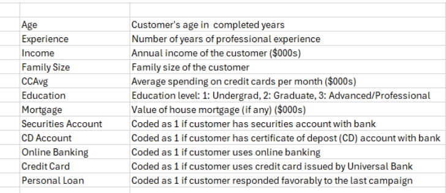

```{r setup, include=FALSE}
knitr::opts_chunk$set(echo = TRUE,
                      cache = TRUE, 
                      warning = FALSE,
                      message = FALSE)
```

Universal Bank is a relatively young bank that is growing rapidly in terms of overall customer acquisition. The majority of these customers are liability customers with varying sizes of relationship with the bank. The customer base of asset customers is quite small and the bank is interested in growing its base. A campaign the bank ran for liability customers showed a healthy conversion rate of over 9% successes. This has encouraged the retail marketing department to devise smarter campaigns with better target marketing. The goal of the analysis is to model the previous campaigns customer behavior to figure out what combinations of factors make a customer more likely to accept a personal loan. The data is contained in the UniversalBank.csv.



1.  Fit a model that including all possible linear predictors of whether or not someone accepted a personal loan in the last campaign (PersonalLoan). When fitting a model, it is always best to verify there is no missing values. Make sure that you remove variables that are not appropriate to have in the model.

```{r}
df<-read.csv("https://raw.githubusercontent.com/losiewbw/ISA633/main/UniversalBank.csv", stringsAsFactors = TRUE)
df$Education = as.factor(df$Education)
df$Securities.Account = as.factor(df$Securities.Account)
df$CD.Account = as.factor(df$CD.Account)
df$Online = as.factor(df$Online)
df$CreditCard = as.factor(df$CreditCard)
df$Personal.Loan = as.factor(df$Personal.Loan)
```

```{r}
colSums(is.na(df))
```

```{r}
df <- df %>% select(c(-ID, -ZIP.Code))
log.reg<-glm(Personal.Loan~., data=df, family="binomial") 
summary(log.reg)
```

2.  Is there evidence that this model is explaining something about the response? Provide the test.

```{r}
1-pchisq(3162-1172.3, 4999-4987)

```

Since this test has a low p-value we know that this model is contributing to the prediction of whether someone accepted a personal loan

3.  Evaluate the models ability to separate the folks who took a personal loan from those who did not.

```{r}
predictions<-predict(log.reg, type="response") #to get probabilities and not log(odds)
roc_object<-roc( df$Personal.Loan, predictions)
roc_object$auc
```
The probability that the model identifies someone will take a loan if they truly have is 0.962

4.  Is there evidence that Income is useful for predicting if someone responded to the Personal Loan offer? Why or why not?

```{r}
log.reg1<-glm(Personal.Loan~., data=df, family="binomial")
summary(log.reg1)
```

Yes, the p-value for Income is significant, in the presence of other variables, for predicting whether someone has responded to a Personal Loan offer

5.  Interpret the coefficient for Income.

```{R}
exp(.06026)
```

The odds of someone responding to a Personal Loan offer increase by 6.2% when Income increases by one unit, holding all else constant

6.  Is there evidence that using online banking is useful for predicting if someone responded to the Personal Loan offer? Why or why not?

Yes, the p-value for someone using online banking is significant, in the presence of other variables, for predicting whether someone has responded to a Personal Loan offer

7.  Interpret the coefficient for Online Banking.

```{r}
exp(-7.564e-01)

```

This means that if a person uses online banking the odds they respond to a Personal Loan offer will decrease by a factor of 0.47 compared to someone who does not use online banking, holding all else constant

8.  Are there predictors in the model that should not be there? Run a stepwise regression (both directions) to find a better model using these predictors. Use linear terms only.

```{r}
step_model <- step(log.reg1)

summary(step_model)
```

```{r}
best_model = glm(formula = Personal.Loan ~ Income + Family + CCAvg + Education + 
    Securities.Account + CD.Account + Online + CreditCard, family = "binomial", 
    data = df)
summary(best_model)
```

9.  What are the odds that a person takes a personal loan over the base case if someone is 37 years old, has a \$29,000 income, a family of 4, an average credit card balance of \$400, a graduate degree, a \$155,000 mortgage and uses online banking. This person does not have a securities account or a CD account or a credit card with Universal Bank. Is it likely that this person takes a personal loan? Use the reduced model.


```{r}
head(predictions)
```
```{r}
log.odds<-predictions[6]
odds<-exp(log.odds)
odds
```


```{r}
-12.970712 + (0.060528*29)+(0.618492*4)+(0.151415*0.4)+3.938590-0.752211

```
```{r}
exp(-5.494487)
```

10. For the reduced model, what is the base case odds?

```{r}
exp(-12.970712)

```
